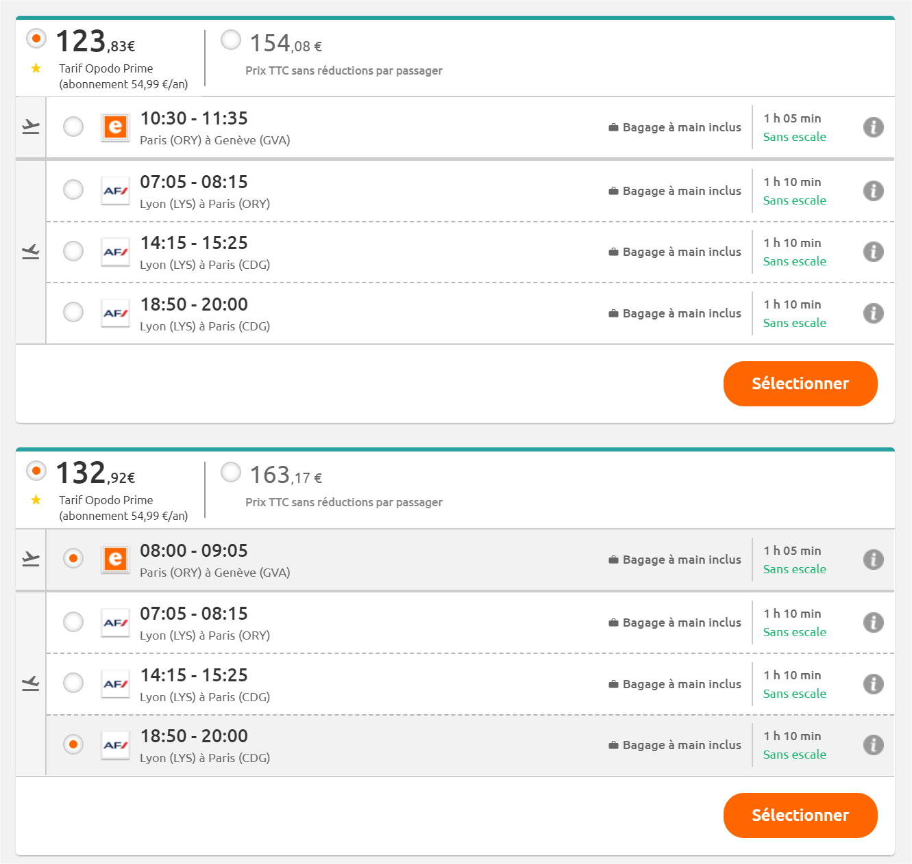

# Objective

The goal here is to create an API that returns flights information. Basically we're trying to develop an API that supplies aggregated flight searches results across multiple providers (skyscanner clone).

This gets materialized by a single endpoint `GET /api/flights?departure_airport=...&arrival_airport=...&departure_date=...&return_date=...&tripType=R|OW`. 

Where:
 * depature_airport is the aiport code from which the user wants to leave
 * arrival_airport is the airport code to where the user wants to travel
 * departure_date is the desired departure date
 * return_date is the desired returning date
 * tripType is an enum indicating whether the trip is one-way (OW) or return (R)

In the whole exercise we assume all trips are for one passenger, that's why it's not part of the parameters.

As described in the Key Points sections: **We would be looking at your code the same way we would be looking at production code.**

# Context

The inventory is maintained by two providers:
 * Air-Jazz
 * Air-Moon


All these suppliers provide their inventory through a simple API. 

For the sake of this exercise, we assume that our providers only return one way flights. Therefore, for someone willing to search for a return trip, we must combine two one way flights. Think of it as the way people search and book train tickets.

## Providers APIs


### Request

Both the suppliers have the same HTTP query format. This format is: 

```
http://flights.beta.bcmenergy.fr/<provider name>/flights?departure_airport=...&arrival_airport=...&departure_date=...
```

Where:
 * Where provider name is either `jazz` or `moon`
 * depature_airport is the aiport code from which the user wants to leave
 * arrival_airport is the airport code to where the user wants to travel
 * departure_date is the desired departure date

So for instance those are valid URLs:
`
http://flights.beta.bcmenergy.fr/jazz/flights?departure_airport=CDG&arrival_airport=LHR&departure_date=2019-03-28
`

And

`
http://flights.beta.bcmenergy.fr/moon/flights?departure_airport=CDG&arrival_airport=LHR&departure_date=2019-03-28
`


All dates follow the format `YYYY-MM-DD`.
All datetimes follow format `YYYY-MM-DDTHH:mm`.
Airport codes are three letters  [IATA Codes](https://en.wikipedia.org/wiki/IATA_airport_code) 
We assume all passengers are coming back to the same airport they left.


### Response

The responses differ between providers.

#### Air Moon

Air Moon response format follows schema:

```
[
  {
    price: : 105.56,
    flight: {
      id: "...",
      departure_airport: "CDG",
      arrival_airport: "LHR",
      departure_time: "2019-03-21T10:00:00", 
      arrival_time: "2019-03-21T11:05:00"
    }
  },
  ...

]

```

#### Air Moon

Air Moon response format follows schema:

```
[
  {
    price: : 105.56,
    legs: [
      {
        id: "...",
        departure_airport: "CDG",
        arrival_airport: "LHR",
        departure_time: "2019-03-21T10:00:00", 
        arrival_time: "2019-03-21T11:05:00"
      }
    ]
  },
  ...

]

```

Where the legs array contains all the flight information. This array always contains one element.


## Search features

### One ways combinable


As described before, return trips are made of two one way flights. 
So for instance, a user leaving from `CDG` (Paris) and going to `LHR` (London), will get back two one ways `CDG <-> LHR` and `LHR <-> CDG`.

To sum up, whenever a user hits our search endpoint (format specified later on), we do:

```
If tripType = R (Return)
Then 
 |  For all our suppliers:
 |  Do
     | We search for a one way trip (with only the outgoing information)
     | We search for a one way trip (with only the returning information)
 |  End
 | 
 |  We combine all the one ways into returns flights
Else if tripType = OW (One Way)
Then
| We only search one way trips with all our suppliers
End

We group the results
```


#### Combination rules

Two one way flights can only be combined if the departureTime of the returning fight is strictly after the arrivalTime of the outgoing flight.


### Grouping

Given the list of available flights, we want to group them according to their price, just like Opodo is doing:



What we want is to group all the flights with the same price. If you look at the following scenario:

User searched for `CDG` <-> `LHR` on the same day, and let's say we got back the following results:

```
O1: {... all the flight info, price: 80}
O2: {... all the flight info, price: 80}
O3: {... all the flight info, price: 50}

I1: {... all the flight info, price: 20}
I2: {... all the flight info, price: 20}
I3: {... all the flight info, price: 20}
I4: {... all the flight info, price: 80}
I5: {... all the flight info, price: 50}
```


So now we could define a group as the following json structure:

```
 {
   price: 100,
   combinations: [
     {
       outbound: {
       ...flight information of O1
       },
       inbound: {
         ...flight information of I1
       }
     },
     {
       outbound: {
       ...flight information of O1
       },
       inbound: {
         ...flight information of I2
       }
     },
     {
       outbound: {
       ...flight information of O1
       },
       inbound: {
         ...flight information of I3
       }
     },
     {
       outbound: {
       ...flight information of O2
       },
       inbound: {
         ...flight information of I1
       }
     },
     {
       outbound: {
       ...flight information of O3
       },
       inbound: {
         ...flight information of I5
       }
     },
   ]   
   }
 }
```

In our example, the combinations `(O2,I2) and (O2,I3)` are not in this group as their departure and arrival time do not make sense (`departure_time > arrival_time`).

As you can see there is a lot of redundant information in this structure, as the flight information of `O1` is used several times.

**We need you to define a better data structure (and the accompanying algorithm) that optimizes data occupation (either accross groups or the whole response).**

Reducing data occupation does not mean removing possible combinations, but finding a way to keep the same level of information (combination) but with less memory (or json size).

### Response formats

The response is free of choice, but must contain at least:
 * The search parametes the user entered
 * The groups with their prices
 * The possible combinations within each group
 * The flights information (id, departure time, arrival time, airports, ...)


# Bonus

The following points are not required, but provide an extra bonus ;) If you do not have time to write the code, you can just explain us how you will tackle it. Of course, the code is preferred :)
 * We would like to be able to cache and reuse results. Be aware that the response can be quite big / huge.
 * We would like to be able to perform searches using a search radius. See "Bonus // Search radius" paragraph
 * We would like the endpoint to be secured. 
 * Beyond security, we need to be able to identify a user
 * Once security and identification in place, we need to be able to rate limit this API. The limit is up to you.
 

 We are also interested in knowing:
  * How you would deploy this in production.
  * What technologies would you use to have a CI/CD running. 

## Bonus // Search radius

All airports can be found in an [online database (CSV)](http://www.partow.net/downloads/GlobalAirportDatabase.zip). Schema for this db is also available [online](http://www.partow.net/miscellaneous/airportdatabase/). 

Using this database, we would like to create an endpoint `GET /airports/:airport/nearby` getting by nearby aiports (50 Km radius) for a given airport.

For instance, to know which airports can be found near `LHR (London)`, one could issue the following reques `GET /airports/CDG/nearby`. Distance can be calculated using different formulas:
 * https://gis.stackexchange.com/questions/21051/distance-between-gps-coordinates
 * https://www.movable-type.co.uk/scripts/latlong.html
 * Whatever distance you want

You can implement this the way you want (create db, store in memory, pre compute results, compute everytime, ...)

The response must be an array containing aiport codes (e.g `["LGW", "LTN", "LCY"]`)


# Key points

The key points we will be looking at are:

 * Tests & testability
 * Architecture and design
 * Code quality
 * Tech choices

We know you may not have the time to make everything work fine, so it's ok to create dummy functions i.e functions that do nothing but are important for the process. 

If you take any shortcurt in your code, please comment it properly why you did it and how you would do it properly.